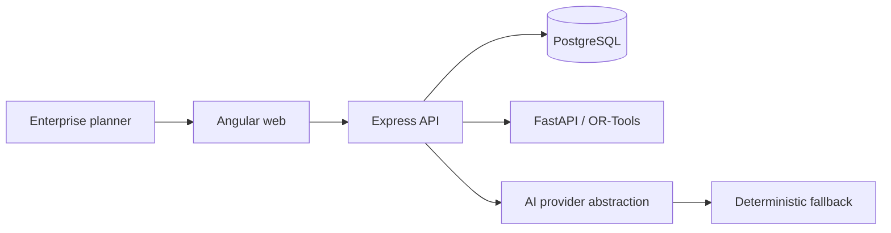

# Architecture

The API authenticates requests, derives the organisation from the signed token, validates DTOs, and applies tenant predicates in repositories. It sends a normalised, authorised problem to the optimiser. Solver output is persisted before the explanation provider receives structured recommendation facts. The LLM boundary cannot alter financial results.

## Security model
JWT access tokens carry user, organisation, and role claims. RBAC protects capabilities while tenant filters protect records. Passwords use Node's scrypt KDF and timing-safe verification; secrets are environment-based; Helmet, constrained CORS, validation, sanitised errors, and audit events provide defence in depth. The Prisma-backed repository increment will wrap multi-record decisions in transactions. Production deployment should add rotating refresh tokens and an external secret manager.
